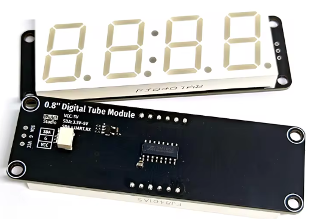

# Overview
This repository holds code and STL files for a four digit LED display module that uses MQTT for data and control.  The code also includes clock code that will retrieve accurate time form an NTP server.

# Electronics
The display used for this project is readily found on AliExpress.  Specifically, this display was used:

https://www.aliexpress.us/item/3256807151353647.html

Other displays based on the TM1652 driver would not require code change.  Other displays may need changes and that is outside the scope of this project but this can be a good starting place.

## Controller
A WeMos D1 mini clone is the controller for this project.  Only a single data pin is required and the display is powered form the +5v connection.  The display will operate on 3.3 volts but that limits the display brightness.  The data is one direction and therefore level shifting is not a concern for the 3.3v ESP8266.

## Power
The display is powered form the US?B connection on the D1 Mini.  While it will operation properly, the display does use a significant amount of power (about 180mA at full brightness with all segments on, 80mA in clock mode w/lowest brightness).  It is, therefore not recommended to use a battery for power for long periods of time.

# Configuration
The code include a configuration file in the include folder named `config.h`. You can use this file however it will be committed to github (if you fork this repository) and will contain sensitive information.  It is, therefore, suggested
that you use the config.h file as a reference and create a file called `myconfig.h` in the include folder so you don't accidentally commit your passwords, and such.

## MQTT
The typical MQTT parameters such as server, port, user, and password must be changed.  In addition the topic paths need to be changed to your preferences.

### Status
The status topic is used to publish the status of the device.  The payload `online` is sent when the MQTT broker connection is made.  Similarly the payload `offline` is sent when the MQTT connection is broken.  Note that the MQTT connection is persistent so it is unlikely you will see the `offline` payload.  Finally, if you send a message to the `reboot` topic, the status payload of `rebooting` will be sent.

### Control topics
There are a few control topics used to send data to or otherwise control the display.

#### intensity
As you might expect, sending a value to this topic changes the display intensity. Values can range from 0-7 where 0 if off and 7 is maximum brightness.

#### clear
Clears the display.  The payload value is ignored.

#### state
Sets the value on the display.  This must be an integer.

#### mode
When `clock` is sent to this topic, the display will show the current time in the time zone specified in `config.h` or `myconfig.h`.

#### reboot
Sending any payload to this topic will reboot the module.

# Enclosure
The enclosure can be found on Tinkercad [here](https://www.tinkercad.com/things/bmd641Jufiy-4-digit-led-display). This used the work of [@fragusan](https://www.tinkercad.com/users/lUXA3s6xb7y-fragusan) who modeled the WeMos D1 mini.

The space between the back of the case and the display requires the used of a small amount of padding.  I used the foal insert that came with the display and cut two strips the width of the display.  The foam was placed on the features in the front of the case and the display was positioned on the foam.  This made a secure fit between the features in the back case and the display.  The case and back of the case are affixed using four M1.4x5 sheet metal screws.

## Assembly
To ensure a rattle free fit, the display is pressed towards the front by the back.  The tolerances are such that a small piece of foam is used to eliminate the gaps.  I used the foam packaging insert that came with the display and cut two strips the width of the display.  The foam was placed between the case and the display board on each end. This made a secure fit between the display end the back case.

The case and back of the case are then secured together using four M1.4x5 sheet metal screws.

## Connections
The wire that comes with the display is terminated on one end with female DuPont connectors.  This are removed and the wires are soldered to the D1 Mini directly.  It is useful to trim the length a bit as the fill length wires make it more difficult to assemble the case.

The hole in the case for the USB connector may be oversized for your USB cable but is, by default, large enough to use what seems to be a somewhat standard USB power plug included with many devices.

# Materials
* [Display](https://www.aliexpress.us/item/3256807151353647.html)
* [Screws](https://www.aliexpress.us/item/3256805283114593.html)
* [D1 Mini](https://www.aliexpress.us/item/3256807691590176.html)